# JSON(JavaScript Object Notation)<div id="author">by PGKan</div>

This is a document for introducing JSON format, there will be some information
about JSON and a guide for using JSON as a medium of information interchange in
Java using Eclipse IDE.

The guide includes the introduction and installation of libraries needed in
Eclipse for using JSON and a tutorial for using Gson to work with JSON files,
basic input/output, and some more advanced object conversions. Some sample
codes will be provided.

---

## Outline
- [About JSON](#about-json)
	- [Data types](#data-types)
	- [Syntax](#syntax)
- [Library: Gson](#library-gson)
	- [Download](#download)
	- [Installation](#installation)
		- [As Maven project](#install-as-maven-project)
		- [As Jar files](#install-as-jar-files)
- [Tutorial](#tutorial)
	- [Test the installation](#test-the-installation)
	- [Create a Gson Object](#create-a-gson-object)
	- [Serialization](#serialize-json-with-tojson)
	- [Deserialization](#deserialize-json-with-fromjson)
	- [Field Exclusion](#fields-exclusion)
	- [Version Support](#version-support)
	- [Custom Conversion](#custom-conversion)
		- [Policies and Strategies](#policies-and-strategies)
		- [Type Adapter](#type-adapter)
- [Alternative Libraries](#alternative-libraries)
- [Reference](#reference)
---
[<ul id="page-breaker" type="none"><li><div align="right">[Back to top]</div></li></ul>](#jsonjavascript-object-notationby-pgkan)

## About JSON
JSON is a lightweight text format that facilitates structured data interchange
between all programming languages. It is easy for humans to read and write,
also for machines to parse and generate. Although it is a subset of the
JavaScript Programming Language, JSON is a text format that is completely
language independent. It uses conventions of the C-family of languages,
including C, C++, C#, Java, JavaScript, Perl, Python, and many others. These
properties make JSON an ideal data-interchange language.

JSON is syntax of braces, brackets, colons, and commas that is useful in many
contexts, profiles, and applications. Its text is a sequence of Unicode code
points. It also depends on Unicode in the hex numbers used in the `\u`
escapement notation. Because JSON is lightweight and dsom simple, it is not
expected that the JSON grammar will ever change. This gives JSON, as a
foundational notation, tremendous stability.

JSON is built on two structures:
- A collection of name/value pairs. In Java, this is realized as an `Object`,
a name/value pair corresponds to a field of an object.
- An ordered list of values. In Java, this is realized as an `Array`.

As most of the modern programming languages support the structures above, the
JSON is interchangeable in programming languages that based on these structures.

---
[<ul id="page-breaker" type="none"><li><div align="right">[Back to top]</div></li></ul>](#jsonjavascript-object-notationby-pgkan)

### Data types
JSON consists of the following data types:
- `Number`: a signed *decimal* number that may contain a fractional part and may
use exponential E notation, but cannot include non-numbers such as `NaN`. Just
like JavaScript, the format makes no distinction between integer and
floating-point.
- `String`:  a sequence of zero or more Unicode characters. Strings are
delimited with double quotation marks and support a backslash escaping syntax.
- `Boolean`: either of the values `true` or `false`
- `Array`: an ordered list of zero or more values, each of which may be of any
type. Arrays use square bracket notation with comma-separated elements.
- `Object`: an unordered collection of name-value pairs where the names are
strings. Objects are intended to represent associative arrays, where each
key is *unique* within an object. Objects are delimited with `{` and `}`, and
use `,` to separate each pair, while within each pair of the `:` character
separates the name from its value.
- `null`: An empty value, using the word `null`
> JSON is case sensitive with `true`, `false` or `null`.
---
[<ul id="page-breaker" type="none"><li><div align="right">[Back to top]</div></li></ul>](#jsonjavascript-object-notationby-pgkan)

### Syntax
<details>
	<summary>JSON grammar</summary><hr/>
	<p>
		An <b>object</b> is an unordered set of name/value pairs. An object
		begins with <code>{</code>  and ends with <code>}</code>. Each name
		is followed by <code>:</code> and the name/value pairs are separated
		by <code>,</code>.
		
	</p>
	<hr/>
	<p id="page-breaker">
		An <b>array</b> is an ordered collection of values. An array begins with
		<code>[</code> and ends with <code>]</code>. Values are separated by
		<code>,</code>.
		
	</p>
	<hr/>
	<p id="page-breaker">
		A <b>value</b> can be a string in double quotes, or a
		<code>number</code>, or <code>true</code> or <code>false</code> or
		<code>null</code>, or an <code>object</code> or an <code>array</code>.
		These structures can be nested.
		
	</p>
	<hr/>
	<p id="page-breaker">
		A <b>string</b> is a sequence of zero or more Unicode characters,
		wrapped in double quotes, using backslash escapes. A character is
		represented as a single character string. A string is very much like a C
		or Java string.
		
	</p>
	<hr/>
	<p id="page-breaker">
		A <b>number</b> is very much like a C or Java number, except that the
		octal and hexadecimal formats are <b>NOT</b> used.
		
	</p>
	<hr/>
	<p>
		<b>Whitespace</b> can be inserted between any pair of tokens. Excepting
		a few encoding details, that completely describes the language.
		
	</p>
</details>

---
<details>
	<summary>JSON grammar in McKeeman Form</summary>
	<pre>
<code>json
	element
value
	object
	array
	string
	number
	"true"
	"false"
	"null"
object
	'{' ws '}'
	'{' members '}'
members
	member
	member ',' members
member
	ws string ws ':' element
array
	'[' ws ']'
	'[' elements ']'
elements
	element
	element ',' elements
element
	ws value ws
string
	'"' characters '"'
characters
	""
	character characters
character
	'0020' . '10FFFF' '"' '\'
	'\' escape
escape
	'"'
	'\'
	'/'
	'b'
	'f'
	'n'
	'r'
	't'
	'u' hex hex hex hex
hex
	digit
	'A' . 'F'
	'a' . 'f'
number
	integer fraction exponent
integer
	digit
	onenine digits
	'-' digit
	'-' onenine digits
digits
	digit
	digit digits
digit
	'0'
	onenine
onenine
	'1' . '9'
fraction
	""
	'.' digits
exponent
	""
	'E' sign digits
	'e' sign digits
sign
	""
	'+'
	'-'
ws
	""
	'0020' ws
	'000A' ws
	'000D' ws
	'0009' ws</code></pre>
</details>

---
[<ul id="page-breaker" type="none"><li><div align="right">[Back to top]</div></li></ul>](#jsonjavascript-object-notationby-pgkan)

## Library: Gson
There is a fast amount of libraries on the internet for JSON in Java. The Gson
library released from Google is an open-sourced utility library for serialising
an Object in Java to JSON text, and deserialising JSON text to an Object in
Java. The Gson library is chosen in this study because it is an open-sourced
library, it is a stable and secure library, and there is a large amount of study
and tutorial on the internet.

### Download
You can download Gson from [GitHub][gson-github] directly and build it on the
local environment, or download the Gson jar from [Maven Central][gson-maven].
If you have downloaded Gson from GitHub, follow the instruction on GitHub to
build the Gson. If you want to download Gson from Maven Central, click the
`Downloads` button at the right-hand side of the page and select `jar`
(mandatory). You can also download the `javadoc.jar` and the `sources.jar`(not
vital for the actions below).

---

### Installation
#### Install as Maven project
If you have downloaded the Gson library from GitHub, you need to import the
downloaded sources as Maven project and add project dependency at your project
to the Gson project.
<details>
	<summary>Procedure</summary>
	<p>1. Import Gson as a Maven project.</p>
	<p>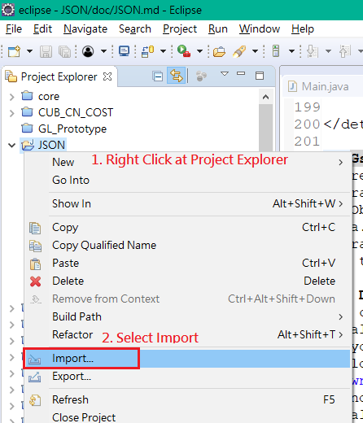</p>
	<p>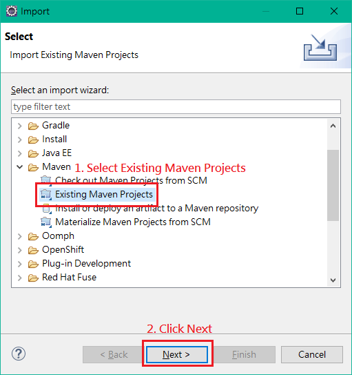</p>
	<p>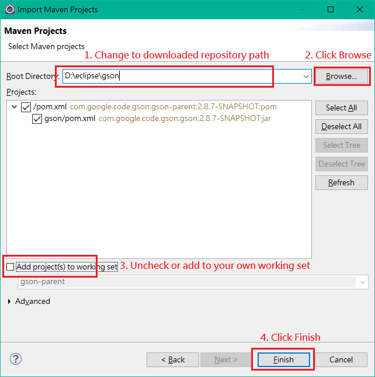</p>
	<p>2. Add project dependency to your project build path.</p>
	<p>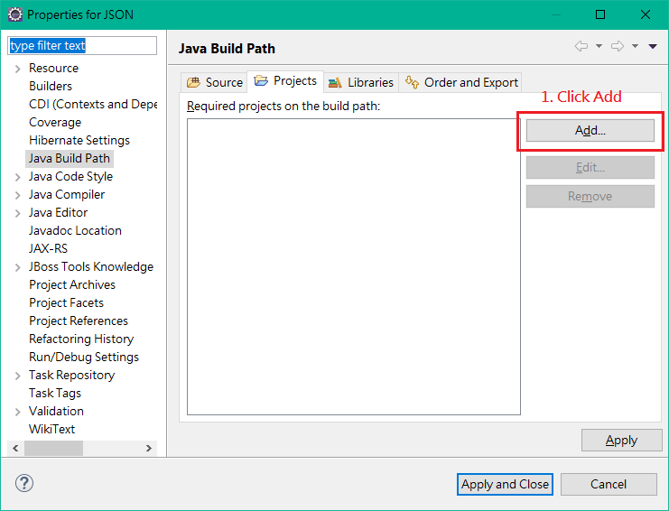</p>
	<p>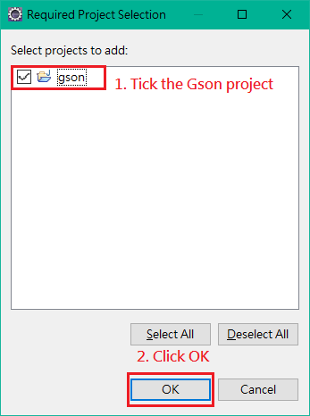</p>
	<p>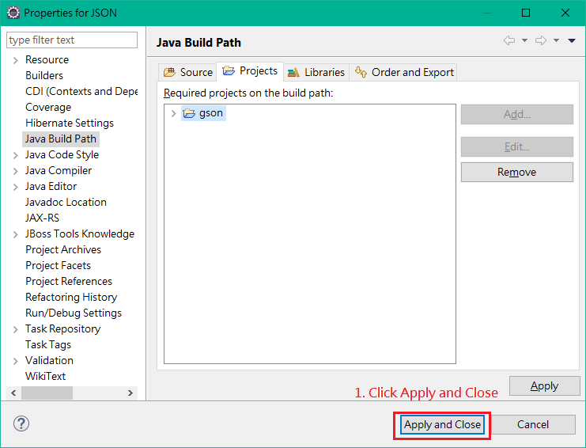</p>
</details>

---
[<ul id="page-breaker" type="none"><li><div align="right">[Back to top]</div></li></ul>](#jsonjavascript-object-notationby-pgkan)

#### Install as Jar files
If you have downloaded the Gson library as Jar files, you need to add the
library into your build path reference.
<details>
	<summary>Procedure</summary>
	<p>1. Add Gson library Jar file into your project.</p>
	<p id="page-breaker">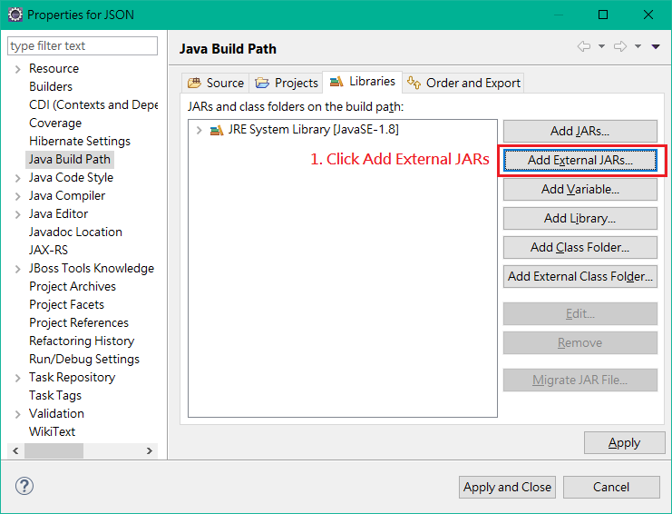</p>
	<p>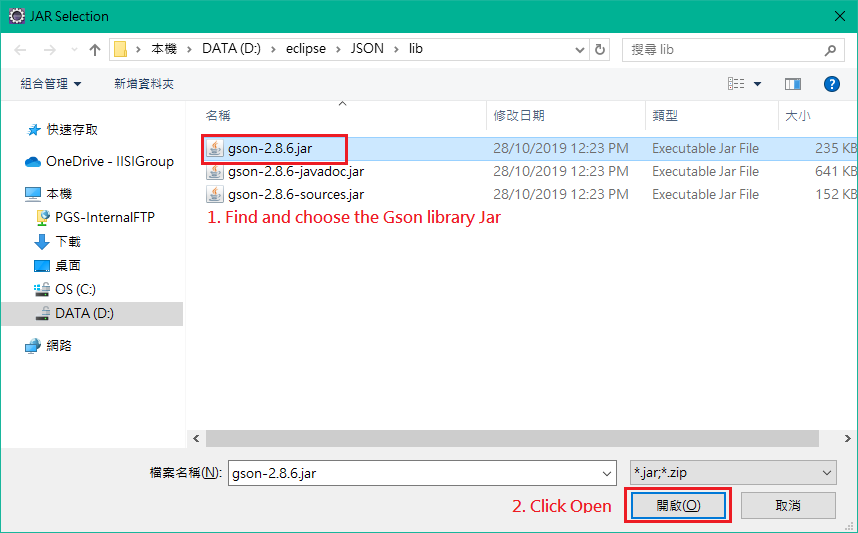</p>
	<p>2. Optional: add javadoc and source Gson library.</p>
	<p>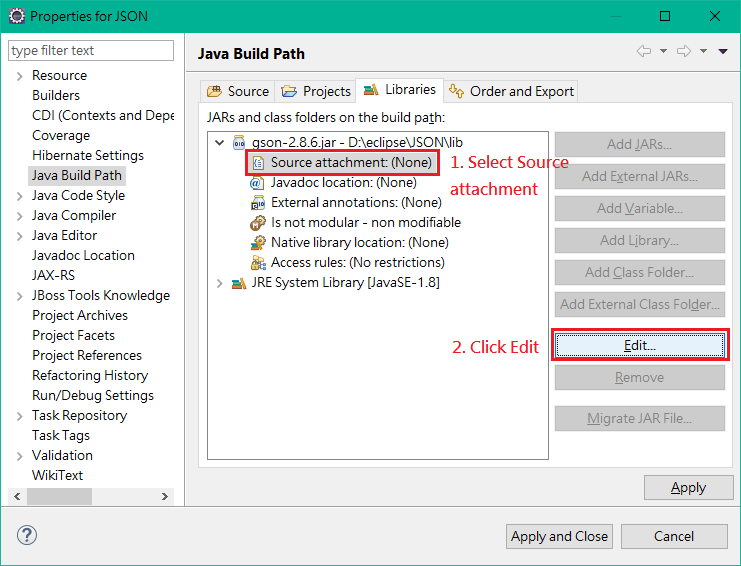</p>
	<p></p>
	<p>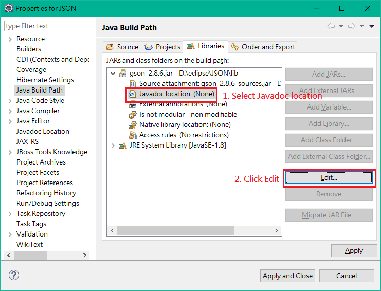</p>
	<p>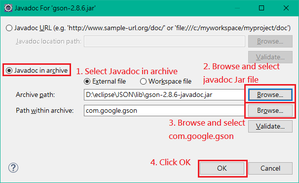</p>
	<p>3. Apply editions.</p>
	<p>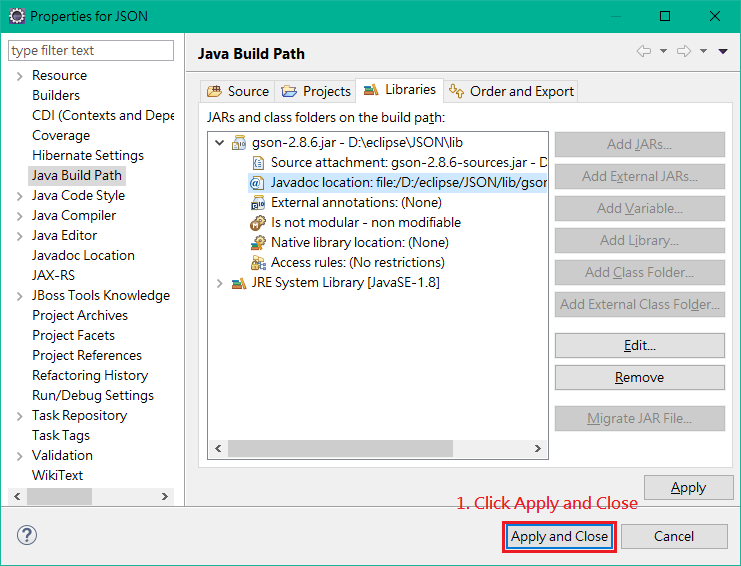</p>
</details>

---
[<ul id="page-breaker" type="none"><li><div align="right">[Back to top]</div></li></ul>](#jsonjavascript-object-notationby-pgkan)

## Tutorial
### Test the installation
If you have downloaded the full repository from GitHub, you should have a source
folder called `test`. Under `src/test`, there should be two source files
`EnvironmentTest.java` and `JsonTestObject.java`. Go to `EnvironmentTest` and
run as **Java Application**.

If the application output the following string, your
installation is correct and complete.
```
Environment Test
Input test succeeded!
Output test succeeded!
JSON test succeeded!
```

If you receive an error message: `Missing file: "res/json-test.json"`, you have
not downloaded the full repository, or the path configuration is faulty.

---
[<ul type="none"><li><div align="right">[Back to top]</div></li></ul>](#jsonjavascript-object-notationby-pgkan)

### Create a Gson Object
There are 2 methods to create a Gson Object instance in the Gson library.
- `new Gson()`
- `new GsonBuilder().create()`

The first method is a quick and easy way to instantiate a Gson object with
default settings. However, there are a lot of settings you can configure with
if the second `GsonBuilder` method is used to instantiate a Gson object.

For example,
```Java
Gson gson = new GsonBuilder()
	.serializeNulls() // tells Gson do not skip null value
	.setPrettyPrinting() // makes the output JSON text formatted
	.excludeFieldsWithModifiers(
		Modifier.TRANSIENT, Modifier.STATIC
	) // exclude some modifiers
	.create(); // create a Gson instance
```

When using `GsonBuilder` to create a Gson object, you can chain the settings
together to create a Gson object with those settings. More about Gson settings
in a later chapter.

For more details, browse the [Gson Javadoc][gson-javadoc] online.

---
[<ul type="none"><li><div align="right">[Back to top]</div></li></ul>](#jsonjavascript-object-notationby-pgkan)

### Serialize JSON with toJson()
Gson can generate JSON string from Java Objects with the method `toJson()` of a
`Gson` instance. You can simply give any `Object` to `toJson()`, the Json string
will be generated.

The 3 basic data types in the JSON format, they are `String`, `Number` and
`Boolean`, there are the mapping of data type between Gson and JSON.

|Java Type|JSON Type|
|:---|:---|
|Character|String|
|String|String|
|Byte, Short, Integer, Long|Number|
|Float, Double|Number|
|Boolean|Boolean|

> In Gson library, all Java primitive types will be treated as its wrapper
type

---
Consider the following Java code:
```Java
String b = gson.toJson(new Boolean(true));
String i = gson.toJson(new Integer(Integer.MAX_VALUE));
String d = gson.toJson(new Double(Double.MAX_VALUE));
String c = gson.toJson(new Character('C'));
String s = gson.toJson("String");
String n = gson.toJson(null);
```
Their value after serialized into JSON by Gson:
```
true                    // the data type is Boolean
2147483647              // the data type is Number
1.7976931348623157E308  // the data type is Number
"C"                     // the data type is Stirng
"String"                // the data type is Stirng
null
```

---
The 2 structured data types in the JSON format, `Object` and `List`. Gson
treats all Java `Object` as `Object` in JSON, excepted for the implementations
of `Collection`. The type of `Array` and implementations of `Collection` are
treated as JSON `List` in Gson.

Consider the following Java code:
```Java
List<String> list = new ArrayList<>();

Set<String> set = new HashSet<>();
set.add("set item 0");
set.add("set item 1");
set.add("set item 2");

String strings[] = {"string 0", "string 1", "string 2"};

Map<Integer, String> map = new HashMap<>();
map.put(0, "map item 0");
map.put(1, "map item 1");
map.put(2, "map item 2");
```
Their value after serialized into JSON by Gson:
```
// an empty list
[]

// the order of a set is determined by the hash value of the item
["set item 0","set item 2","set item 1"]

// array or any ordered list structure keep their order
["string 0","string 1","string 2"]

// maps are treated as an object/map in JSON and the order of its
// items are determined by the hash value of the key
{"0":"map item 0","1":"map item 1","2":"map item 2"}
```
Consider the following Java code:

Definition of `Car` and `Engine`:
```Java
public class Car {
	public Car() {
		this.brand = "TOYOTA";
		this.model = "PRIUS α";
		this.capacity = 7;
		this.engine = new Engine();
	}
	private String brand    = "TOYOTA";
	private String model    = "PRIUS α";
	private int    capacity = 7;
	private Engine engine   = new Engine();
}
```
```Java
public class Engine {

	public Engine() {
		this("TOYOTA", "2ZR-FXE", 1798, 13, new double[2], new double[2]);
		this.maxPowerRPM[0] = 99;
		this.maxPowerRPM[1] = 5200;
		this.maxPowerRPM[0] = 14.5;
		this.maxPowerRPM[1] = 4000;
	}

	public Engine(String brand, String model, double displacement,
		double compressionRate, double[] maxPowerRPM, double[] maxTorqueRPM) {
		this.brand = brand;
		this.model = model;
		this.displacement = displacement;
		this.compressionRate = compressionRate;
		this.maxPowerRPM = maxPowerRPM.clone();
		this.maxTorqueRPM = maxTorqueRPM.clone();
	}

	private String brand;
	private String model;
	private double displacement;
	private double compressionRate;
	private double maxPowerRPM[];
	private double maxTorqueRPM[];
}
```

```Java
String car = gson.toJson(new Car());
```
The serialized JSON text will look like this:
```JSON
{
  "brand": "TOYOTA",
  "model": "PRIUS α",
  "capacity": 7,
  "engine": {
    "brand": "TOYOTA",
    "model": "2ZR-FXE",
    "displacement": 1798.0,
    "compressionRate": 13.0,
    "maxPowerRPM": [
      99.0,
      5200.0
    ],
    "maxTorqueRPM": [
      14.5,
      4000.0
    ]
  }
}
```
`Engine` itself is a separate class in Java. Therefore after the object `Car`
serialized into JSON text, the value of object property `engine` contains a
JSON object with the properties of an `Engine`.
> The text output by Gson will not be formatted unless the Gson instance you use
is configured by `setPrettyPrinting`.

---
[<ul type="none"><li><div align="right">[Back to top]</div></li></ul>](#jsonjavascript-object-notationby-pgkan)

### Deserialize JSON with fromJson()
Gson can deserialize a JSON string to a Java Object with the method `fromJson()`
of a `Gson` instance. This method requires 2 arguments, the JSON string and the
Javatype of the targeted class.

Consider the following codes:
```Java
// the definition of class Car is the same as above
Car myCar = gson.fromJson(new FileReader("res/car.json"), Car.class);
System.out.println(myCar.toString());
System.out.println(new Car());
```

Content of car.json:
```JSON
{
	"brand" : "HONDA",
	"model" : "ODYSSEY APEX",
	"capacity" : 8,
	"engine" : {
		"brand" : "HONDA",
		"model" : "i-VTEC DOHC",
		"displacement" : 2356.0,
		"compressionRate" : 10.1,
		"maxPowerRPM" : [
			129.0,
			6200.0
		],
		"maxTorqueRPM" : [
			23.0,
			4000.0
		]
	}
}
```

The output data:
```
Car [brand=TOYOTA, model=PRIUS α, capacity=7, engine=Engine [brand=TOYOTA,
	model=2ZR-FXE, displacement=1798.0, compressionRate=13.0,
	maxPowerRPM=[99.0, 5200.0], maxTorqueRPM=[14.5, 4000.0]]]
Car [brand=HONDA, model=ODYSSEY APEX, capacity=8, engine=Engine [brand=HONDA,
	model=i-VTEC DOHC, displacement=2356.0, compressionRate=10.1,
	maxPowerRPM=[129.0, 6200.0], maxTorqueRPM=[23.0, 4000.0]]]
```
In the output object `myCar`, the properties loaded from `car.json` will
replace the default properties of the class `Car`.

---
[<ul type="none"><li><div align="right">[Back to top]</div></li></ul>](#jsonjavascript-object-notationby-pgkan)

### Fields Exclusion
Some fields of an object may use in Java program exclusively, and you don't want
to serialse those fields. There are some methods to exclude specific field from
JSON string generation.

1. By default any field with the value `null` will be excluded. If you want Gson
serialize `null` values, add `serializeNulls()` to your `GsonBuilder`.

---
2. The `static` or`transient` modifier. Just likes using `Serializable`,
`transient` fields will not be writen into `OutputStream` by `writeObject`.
> If `excludeFieldsWithModifiers()` is used to configure the Gson instance, the
default exclusion of modifier `static` and `transient` will be overriden.

---
3. The `@Expose` annotation. The Gson library provides an annotation
`com.google.gson.annotations.@Expose` to set the field is or is not
(de)serializable. The annotation `@Expose` takes 2 arguments to specify the 
(de)serializability of a field. By default `@Expose` makes a field both
serializable and deserializable by Gson. Give parameter `serialize` or
`deserialize` to the annotation to specifically set a field cannot be serialized
or deserialized.
```Java
@Expose(serialize = false) // the field will not serialize by Gson
@Expose(deserialize = false) // the field will not deserialize by Gson
@Expose(serialize = false, deserialize = false) // the field will not serialize
                                                // and deserialize by Gson
```

---
4. The `ExclusionStrategy` interface. The Gson library provides an interface
`com.google.gson.ExclusionStrategy` to set on a `GsonBuilder`. A `Gson` instance
with `ExclusionStrategy` will check a field shoud or should not (de)serialize by
the `shouldSkipField()` and `shouldSkipClass()` methods implement from the
`ExclusionStrategy` interface.

An example of using ExclusionStrategy:
```Java
public class ExcludeEngineStrategy implements ExclusionStrategy {
	@Override
	public boolean shouldSkipField(FieldAttributes f) {
		return f.getName().equals("engine")
			|| f.hasModifier(Modifier.STATIC);
	}
	@Override
	public boolean shouldSkipClass(Class<?> clazz) {
		return false;
	}
}
```
```Java
Gson gson = new GsonBuilder()
	.excludeFieldsWithModifiers(Modifier.TRANSIENT)
	.setExclusionStrategies(new ExcludeEngineStrategy())
	.setPrettyPrinting()
	.create();
	System.out.println(gson.toJson(new Car()));
```

The `ExcludeEngineStrategy` above will cause the `Gson` instance skip field named
as "engine" and all `static` fields.

The output will looks like this:
```JSON
{
  "brand": "TOYOTA",
  "model": "PRIUS α",
  "capacity": 7
}
```
There is no output data for the field engine.

---
There is another `Gson` instance with difference configuration:
```Java
Gson gson = new GsonBuilder()
	.excludeFieldsWithModifiers(Modifier.TRANSIENT)
	.setPrettyPrinting()
	.create();
```
If this `Gson` instance is used instead, the output will looks like this:
```JSON
{
  "MODEL_CAR": {
    "brand": "Mercedes-Benz",
    "model": "GLS 350d",
    "capacity": 7,
    "engine": {
      "brand": "Mercedes-Benz",
      "model": "4MATIC G-TRONIC",
      "displacement": 2987.0,
      "compressionRate": 15.5,
      "maxPowerRPM": [
        192.4,
        3400.0
      ],
      "maxTorqueRPM": [
        63.2,
        2400.0
      ]
    }
  },
  "brand": "TOYOTA",
  "model": "PRIUS α",
  "capacity": 7,
  "engine": {
    "brand": "TOYOTA",
    "model": "2ZR-FXE",
    "displacement": 1798.0,
    "compressionRate": 13.0,
    "maxPowerRPM": [
      99.0,
      5200.0
    ],
    "maxTorqueRPM": [
      14.5,
      4000.0
    ]
  }
}
```
Because `excludeFieldsWithModifiers()` did not define `Modifier.STATIC`, the
static field `MODEL_CAR` is output to the JSON string; engine is output to the
JSON string.

---
[<ul type="none"><li><div align="right">[Back to top]</div></li></ul>](#jsonjavascript-object-notationby-pgkan)

### Version Support
The Gson library contains version support functionality. It can base on the
version number on properties to decide whether or not the properties will be
excluded. The method to enable using version support is annotating the
properties with the annotation `com.google.gson.annotations.@Since` and using
`setVersion()` in your `GsonBuilder`.

Consider the follow codes:
```Java
public class Car {

	public Car() {
		this.brand = "TOYOTA";
		this.model = "PRIUS α";
		this.capacity = 7;
		this.engine = new Engine();
	}

	public static Car MODEL_CAR = Car.createModelCar();

	private String brand;
	@Since(1.0)
	private String model;
	@Since(2.0)
	private int capacity;
	@Since(3.0)
	private Engine engine;
```
```Java
private static void noVersion() {
		Gson gson = new GsonBuilder()
			.setPrettyPrinting()
			.create();
		System.out.println(gson.toJson(new Car()));
}

private static void version1() {
	Gson gson = new GsonBuilder()
		.setVersion(1.0)
		.setPrettyPrinting()
		.create();
	System.out.println(gson.toJson(new Car()));
}

private static void version3() {
	Gson gson = new GsonBuilder()
		.setVersion(3.0)
		.setPrettyPrinting()
		.create();
	System.out.println(gson.toJson(new Car()));
}
```

---
If `version1()` is being called, its output the follwing: 
```JSON
{
  "brand": "TOYOTA",
  "model": "PRIUS α"
}
```
The fields annotated as version greater than 1.0 are excluded.

If `version3()` is being called, its output the follwing: 
```JSON
{
  "brand": "TOYOTA",
  "model": "PRIUS α",
  "capacity": 7,
  "engine": {
    "brand": "TOYOTA",
    "model": "2ZR-FXE",
    "displacement": 1798.0,
    "compressionRate": 13.0,
    "maxPowerRPM": [
      99.0,
      5200.0
    ],
    "maxTorqueRPM": [
      14.5,
      4000.0
    ]
  }
}
```
The fields annotated as version 3.0 or below are included. The fields belong to
`Engine` are not annotated with `@Since` annotation therefore they are all
included.

If `noVersion()` is being called, its output the follwing: 
```JSON
{
  "brand": "TOYOTA",
  "model": "PRIUS α",
  "capacity": 7,
  "engine": {
    "brand": "TOYOTA",
    "model": "2ZR-FXE",
    "displacement": 1798.0,
    "compressionRate": 13.0,
    "maxPowerRPM": [
      99.0,
      5200.0
    ],
    "maxTorqueRPM": [
      14.5,
      4000.0
    ]
  }
}
```
The `Gson` serialize all of the fields. Even if the fields are annotated with
`@Since` annotation, without using `setVersion()` in the `GsonBuilder` will not
enable the version support exclusion functionality.

---
[<ul type="none"><li><div align="right">[Back to top]</div></li></ul>](#jsonjavascript-object-notationby-pgkan)

### Custom Conversion
The Gson library provides some customizations to paring and generating JSON
strings for converting between Java type and custom JSON stirng.

#### Policies and Strategies
The Gson library provides two types of configuration to customize the
(de)serialize process, they are policies and strategies. Policies are a bunch of
pre-defined attributes tell how should the `Gson` works to (de)serialize an
`Object`. And Strategies are interfaces that you need to implement before using
it the customize the (de)serialization.

##### Using Policies to Configure Gson
There are 2 types of policy in Gson library, they are `FieldNamingPolicy` and
`LongSerializationPolicy`.

The `FieldNamingPolicy` is used to configure how the `Gson` convert the name of
fields to the keys(names) in a JSON `Object`. The policies can choose from the
`FieldNamingPolicy` are listed below:

|Policy|Field Name|Key Name|
|:---|:---|:---|
|IDENTITY|simpleFieldName|simpleFieldName|
|LOWER_CASE_WITH_DASHES|simpleFieldName|simple-field-name|
|LOWER_CASE_WITH_DOTS|simpleFieldName|simple.field.name|
|LOWER_CASE_WITH_UNDERSCORES|simpleFieldName|simple_field_name|
|UPPER_CAMEL_CASE|simpleFieldName|SimpleFieldName|
|UPPER_CAMEL_CASE_WITH_SPACES|simpleFieldName|Simple Field Name|

The `LongSerializationPolicy` is used to configure how the `Gson` convert `Long`
into JSON string. There is two policies in `LongSerializationPolicy`, `DEFAULT`
and `STRING`. Under `DEFAULT` policy, the `Gson` will serialize Java `Long` into
Json `Number` as chapter 3.3 "[Serialization](#serialize-json-with-tojson)"
stated. Under `STRING` policy, the `Gson` will serialize Java `Long` into Json
`String`.

Consider the following codes:
```Java
Gson gson = new GsonBuilder()
	.setPrettyPrinting()
	.setFieldNamingPolicy(FieldNamingPolicy.LOWER_CASE_WITH_DASHES)
	.create();
System.out.println(gson.toJson(Engine.createModelEngine()));
```

The output will look like this:
```JSON
{
  "brand": "Mercedes-Benz",
  "model": "4MATIC G-TRONIC",
  "displacement": 2987.0,
  "compression-rate": 15.5,
  "max-power-r-p-m": [
    192.4,
    3400.0
  ],
  "max-torque-r-p-m": [
    63.2,
    2400.0
  ]
}
```

---
[<ul type="none"><li><div align="right">[Back to top]</div></li></ul>](#jsonjavascript-object-notationby-pgkan)

##### Using Strategies to Configure Gson
There are 2 types of strategies in Gson library, they are `ExclusionStrategy`
and `FieldNamingStrategy`.

The `ExclusionStrategy` is already stated in chapter 3.5
"[Field Exclusion](#fields-exclusion)", and the `FieldNamingStrategy` is used to
convert the name of fields into the key in JSON string, the translation between
Java fields name and JSON keys name needs to be implemented by the user.

This is an example of using `FieldNamingStrategy`:

The `JavaFieldNamingPolicy.LOWER_CASE_WITH_DASHES` translates the name "RPM"
into "r-p-m", this may not be what you are looking for. You can implement a 
`FieldNamingStrategy` to translate the name instead.

Implementation of `ShortenedNameLowerCaseDashesStrategy`:
```Java
public class ShortenedNameLowerCaseDashesStrategy implements FieldNamingStrategy {

	@Override
	public String translateName(Field f) {
		char originalChars[] = f.getName().toCharArray();
		String newName = "";
		boolean previousCapital = false;
		for (char originalChar : originalChars) {
			boolean currentCapital = originalChar > 0x40
				&& originalChar < 0x5B;
			newName += !previousCapital && currentCapital ? "-" : "";
			newName += (char) (currentCapital ? originalChar + 0x20
				: originalChar);
			previousCapital = currentCapital;
		}
		return newName;
	}
}
```
```Java
Gson gson = new GsonBuilder()
	.setPrettyPrinting()
	.setFieldNamingStrategy(new ShortenNameLowerCaseDashesStrategy())
	.create();
System.out.println(gson.toJson(Engine.createModelEngine()));
System.out.println();
```

The output will look like this:
```JSON
{
  "brand": "Mercedes-Benz",
  "model": "4MATIC G-TRONIC",
  "displacement": 2987.0,
  "compression-rate": 15.5,
  "max-power-rpm": [
    192.4,
    3400.0
  ],
  "max-torque-rpm": [
    63.2,
    2400.0
  ]
}
```

---
[<ul type="none"><li><div align="right">[Back to top]</div></li></ul>](#jsonjavascript-object-notationby-pgkan)

#### Type Adapter
The `registerTypeAdapter()` can customize the conversion between JSON string and
a type. You need to implement a `TypeAdapter` in order to cutomize the
(de)serialization of a type.

This is an example of using TypeAdapter to implement the conversion between
the class `Engine` and JSON string.

Implement a `TypeAdapter` for class `Engine`:

```Java
public class EngineTypeAdapter extends TypeAdapter<Engine> {

	@Override
	public void write(JsonWriter out, Engine value) throws IOException {
		if (value == null) {
			out.nullValue();
		}
		else {
			out.beginArray();
			out.value(value.getBrand());
			out.value(value.getModel());
			out.value(value.getDisplacement());
			out.value(value.getCompressionRate());
			out.beginArray();
			out.value(value.getMaxPowerRPM()[0]);
			out.value(value.getMaxPowerRPM()[1]);
			out.endArray();
			out.beginArray();
			out.value(value.getMaxTorqueRPM()[0]);
			out.value(value.getMaxTorqueRPM()[1]);
			out.endArray();
			out.endArray();
		}
	}

	@Override
	public Engine read(JsonReader in) throws IOException {
		if (in.peek().equals(JsonToken.NULL)) {
			return null;
		}
		Engine engine = new Engine();
		in.beginArray();
		engine.setBrand(in.nextString());
		engine.setModel(in.nextString());
		engine.setDisplacement(in.nextDouble());
		engine.setCompressionRate(in.nextDouble());
		in.beginArray();
		double d[] = new double[2];
		d[0] = in.nextDouble();
		d[1] = in.nextDouble();
		engine.setMaxPowerRPM(d);
		in.endArray();
		in.beginArray();
		d = new double[2];
		d[0] = in.nextDouble();
		d[1] = in.nextDouble();
		engine.setMaxTorqueRPM(d);
		in.endArray();
		in.endArray();
		return engine;
	}
}
```
</details>

Register the `EngineTypeAdapter` using `registerTypeAdapter`:
```
Gson gson = new GsonBuilder()
		.registerTypeAdapter(Engine.class, new EngineTypeAdapter())
		.setPrettyPrinting()
		.create();
```

Use the `Gson` instance to (de)serialize and `Car`:
```Java
String car = gson.toJson(Car.MODEL_CAR);
System.out.println(car);
System.out.println(gson.fromJson(car, Car.class));
```

The output will look like this:
```JSON
{
  "brand": "Mercedes-Benz",
  "model": "GLS 350d",
  "capacity": 7,
  "engine": [
    "Mercedes-Benz",
    "4MATIC G-TRONIC",
    2987.0,
    15.5,
    [
      192.4,
      3400.0
    ],
    [
      63.2,
      24000.0
    ]
  ]
}
```
```
Car [brand=Mercedes-Benz, model=GLS 350d, capacity=7, engine=Engine
	[brand=Mercedes-Benz, model=4MATIC G-TRONIC, displacement=2987.0,
	compressionRate=15.5, maxPowerRPM=[192.4, 3400.0],
	maxTorqueRPM=[63.2, 24000.0]]]
```

The `write()` method of the `EngineTypeAdapter` serialize the `engine` into a
nested JSON `List`, instead of the default serialize method into a JSON `Object`
contains 2 JSON `List`.

The `read()` method of the `EngineTypeAdapter` deserialize the `engine`
`List` and store its data into a new `Engine` instance, instead of returning a
`Engine` with default properties.

---
[<ul type="none"><li><div align="right">[Back to top]</div></li></ul>](#jsonjavascript-object-notationby-pgkan)

## Alternative Libraries
There are more libraries provided in JSON.org, browse [JSON.org][json-org] at the
bottom to see the list of libraries.

---
[<ul type="none"><li><div align="right">[Back to top]</div></li></ul>](#jsonjavascript-object-notationby-pgkan)

## Reference
[json-org]:https://JSON.org
[json-standard]:http://www.ecma-international.org/publications/files/ECMA-ST/ECMA-404.pdf
[gson-github]:https://github.com/google/gson
[gson-maven]:https://search.maven.org/artifact/com.google.code.gson/gson/2.8.6/jar
[gson-javadoc]:https://www.javadoc.io/doc/com.google.code.gson/gson/2.8.6/index.html
[gson-basic]:http://programdoubledragon.blogspot.com/2017/12/gson.html
[java-json-jenkov]:http://tutorials.jenkov.com/java-json/index.html
- [JSON.org][json-org]
- [The JSON Standard ECMA-404][json-standard]
- [GitHub: Gson][gson-github]
- [Maven: Gson][gson-maven]
- [Javadoc: Gson][gson-javadoc]
- [Gson 基礎教學][gson-basic]
- [Java JSON, tutorials.jenkov.com][java-json-jenkov]
---
[<ul type="none"><li><div align="right">[Back to top]</div></li></ul>](#jsonjavascript-object-notationby-pgkan)
